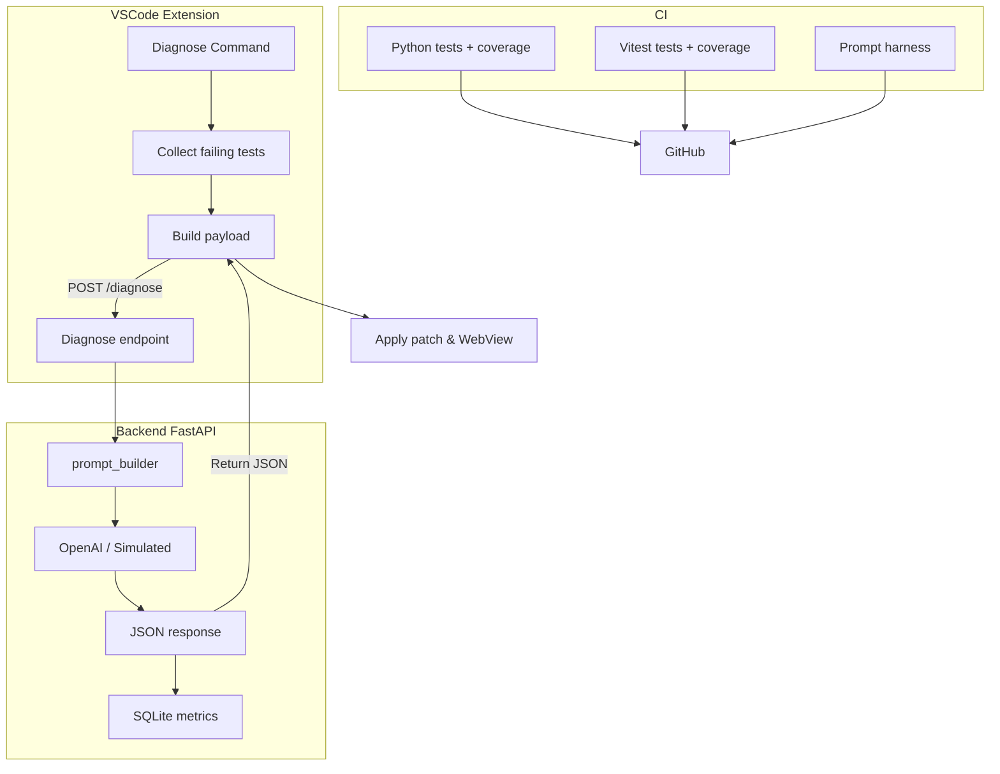

# AI Debugging Copilot Proof-of-Concept

<!-- existing content above -->

---

## 📖 Documentation

- **[Complete Usage Guide](USAGE_GUIDE.md)** - Step-by-step instructions for using the AI Debugging Copilot
- **[ROADMAP.md](ROADMAP.md)** - Upcoming features and development plans
- **[auto-actions.log.md](auto-actions.log.md)** - Development progress and changes

---

## 🛠 How it works (end-to-end)

1. **Run your JS/TS test suite** – the VS Code extension auto-detects Vitest/Jest scripts and executes them with JSON reporter.
2. **Collect failing specs** – only failing test files + stack-trace lines are compressed (gzip + base64).
3. **POST `/diagnose`** – Extension sends `files[]`, `error_log`, and a short change `summary` to the FastAPI backend.
4. **Prompt Builder** – Backend composes a structured prompt:
   * System instructions
   * Few-shot exemplars (circular import, missing dependency, etc.)
   * Retrieved vector snippets
   * Code context around line references
   * Error log & recent-changes summary
5. **LLM call** – With a real `OPENAI_API_KEY` it hits OpenAI; otherwise deterministic simulation.
6. **JSON response** – Contains `root_cause`, `confidence`, `patches[]`, optional `follow_up`.
7. **WebView UI** – Shows root-cause banner, diff viewer, and “Apply patch” button.  Follow-up questions open a reply box.
8. **SQLite metrics** – Duration, token counts, and confidence logged for future analytics.

The complete data flow is illustrated in the diagram below.



---

## 🚀 Quick-start for new coders

```bash
# 1. Install dependencies
python -m venv .venv && source .venv/bin/activate   # Windows: .venv\Scripts\Activate
pip install -r requirements.txt
npm ci

# 2. Run tests (some will fail intentionally)
pytest            # Python
npx vitest run    # JS/TS

# 3. Click “AI Debug Copilot › Diagnose” in VS Code
   – or press ⌘⇧P / Ctrl+Shift+P and type **Diagnose**.

# 4. Review root cause, apply patch, re-run tests.
```

### CI matrix
| Job | Purpose |
|-----|---------|
| **python-tests.yml** | Backend unit tests + ≥80 % coverage gate |
| **vitest.yml** | Extension unit tests + ≥60 % coverage gate |
| **prompt-harness.yml** | Runs synthetic fixtures to keep diagnosis accuracy at 100 % |
| **remote-health.yml** | Pings live Render backend every push & 6 h |

---

## 🧪 Continuous-learning harness
Fixtures in `tests/prompt_fixtures/` model common failures.  The harness test must stay green; adjusting prompts or adding few-shot examples to improve accuracy is safe & cost-free.

---

*Last updated: 2025-07-30*